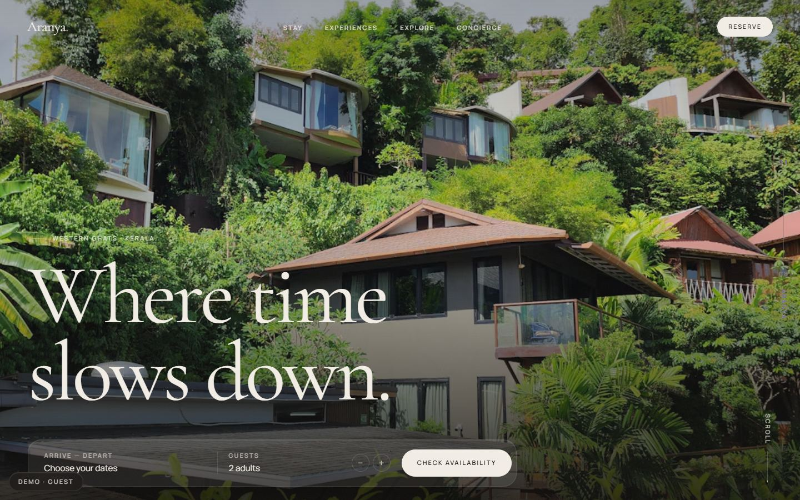
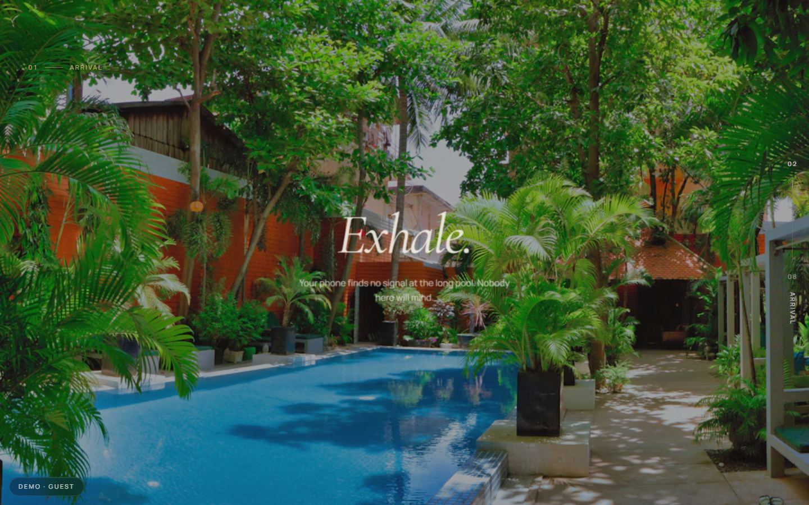
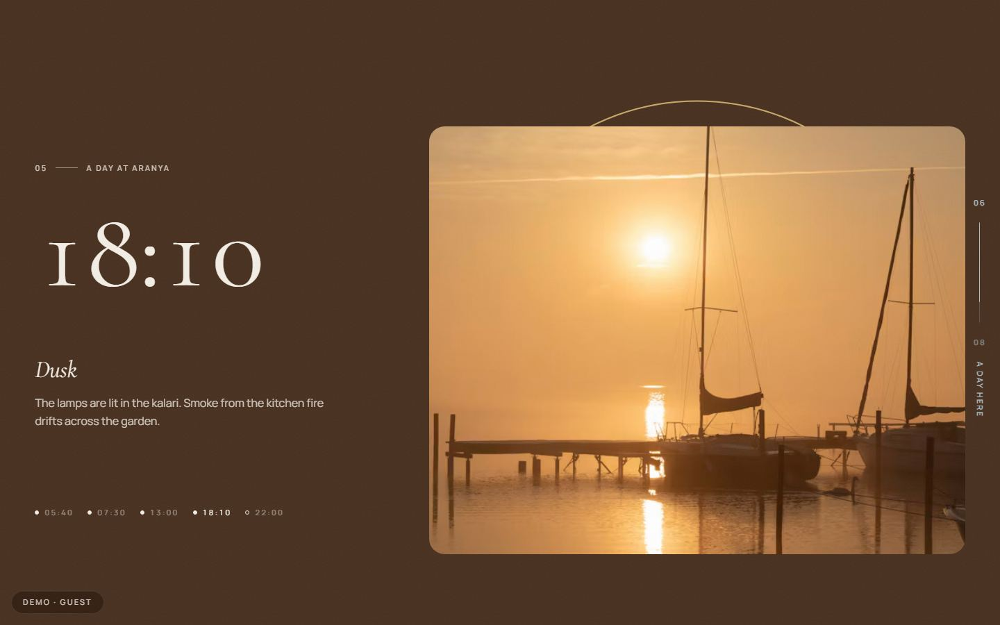
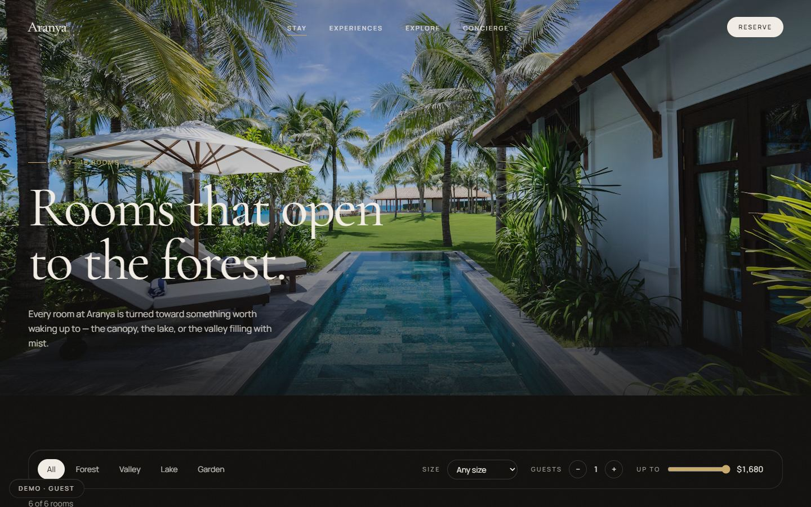
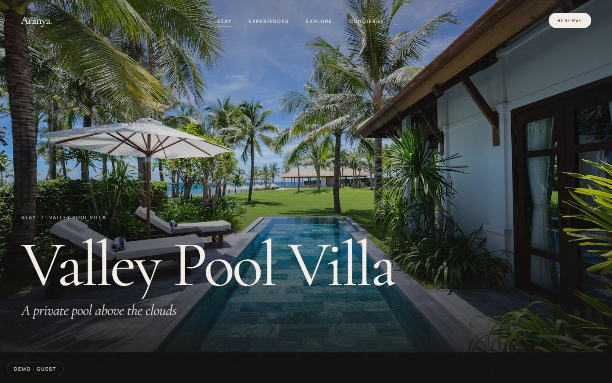
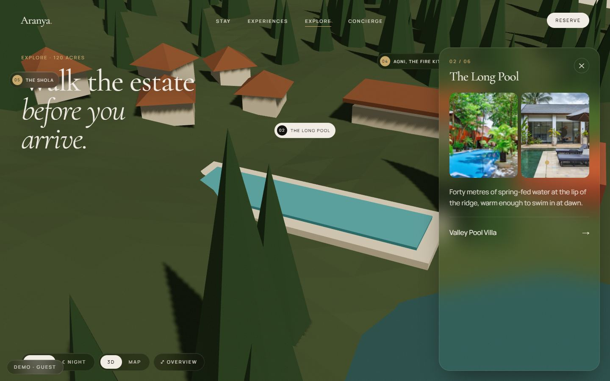
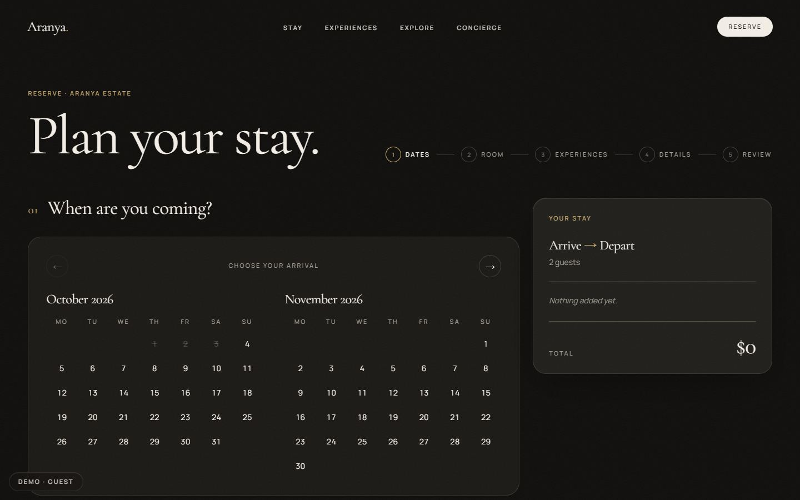
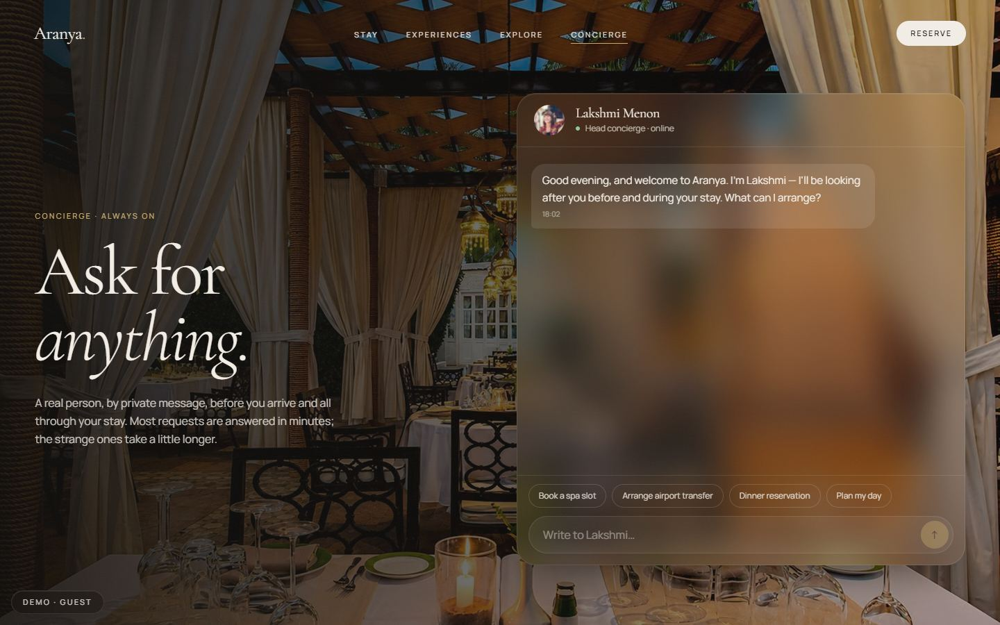
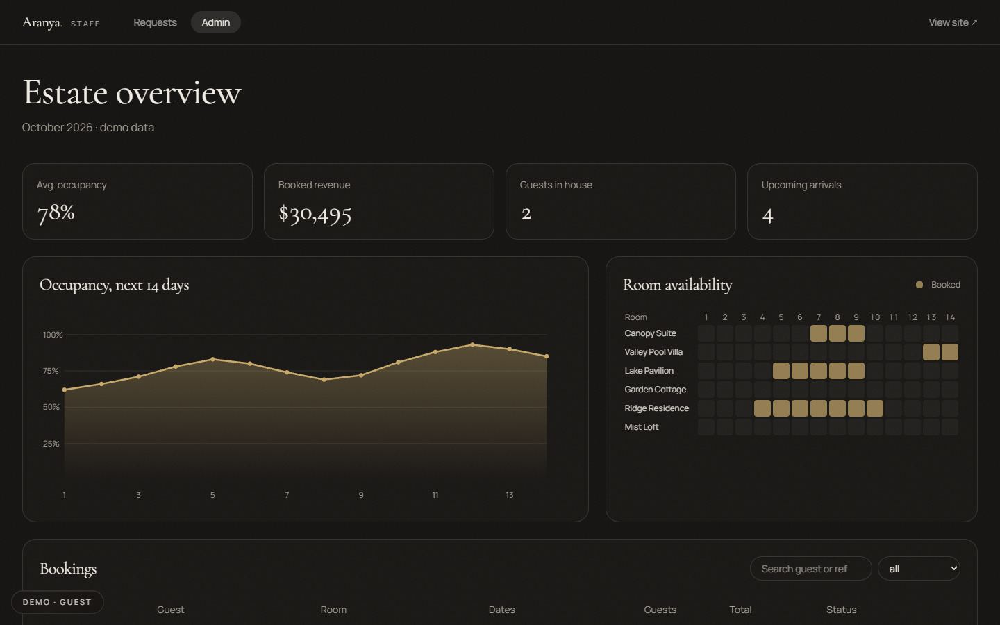

# Aranya Estate — a story-driven luxury resort site

> A portfolio case study in premium custom web development, by **Silvion Technologies**.
> Aranya Estate is a fictional 120-acre forest resort in Kerala's Western Ghats.



| | |
| --- | --- |
|  |  |
|  |  |
|  |  |
|  |  |

## The problem

Most hotel sites are a room grid and a booking widget. Guests can't *feel* a stay before they pay for it, so they compare on price and photos, and the property's real story gets lost.

## The solution

One continuous, cinematic story that walks a guest through the journey they'll actually take:

**Explore the property → discover a room → plan the days → book.**

Behind it is the same journey from the other side: a concierge desk handling guest requests, and an admin view for occupancy, bookings and content. A demo role switcher lets you move between all three views without real authentication.

---

## What's inside

| Route | What it shows |
| --- | --- |
| `/` | **The whole home page is one scroll story**, with a chapter rail and a page-progress line tying it together. 01 Hero (Ken Burns, word-by-word headline, glass booking bar) → 02 Arrival (*pinned*: a framed image opens to full-bleed while "Arrive. / Exhale. / Belong." take turns) → 03 The Estate (parallax at three speeds, count-up stats) → 04 Stay (*pinned*: vertical scroll drives a horizontal room gallery) → 05 Live (clip-path masonry, columns drift apart) → 06 A day at Aranya (*pinned*: 05:40 → 22:00, with background, ink, imagery and a sun arc following the hour) → 07 Voices (crossfading serif testimonials) → 08 Begin your stay (headline grows into place, magnetic button, marquee). |
| `/rooms` | Filter by view, size, guests and price, with Motion `layout` transitions and a sliding pill. |
| `/rooms/[slug]` | The card image **morphs into the hero** (React `<ViewTransition>`). Sticky glass reserve panel, gallery with keyboard lightbox, amenities, an **interactive SVG floor plan**, and "Pair with" experiences. |
| `/experiences` | Wellness / Dining / Adventure / Culture tabs (arrow-key navigable), animated panel swap. |
| `/experiences/[slug]` | Schedule timeline, duration, price, and **Add to stay**, which updates the booking from anywhere. |
| `/explore` | **Signature 3D explorer** (react-three-fiber): a low-poly estate built from primitives on a procedural height field. Click a hotspot and the camera flies there and a glass panel opens. Day/night lighting toggle, drag to orbit. Lazy-loaded behind an elegant loader, with a **2D image-map fallback** for low-end devices and `prefers-reduced-motion`. |
| `/concierge` | Glass chat with Lakshmi, the concierge: typing indicator, mock replies, and quick actions that add experiences to the stay. |
| `/concierge/dashboard` | Request board (New / In progress / Done): drag-and-drop *or* arrow buttons, animated reflow, guest profile drawer. |
| `/booking` | Five steps plus a confirmation: custom range calendar → room → experiences → guest details (react-hook-form + zod) → review with an animated, itemised total → confirmation with a drawn-on seal and booking reference. State persists across pages and reloads. |
| `/admin` | A calm, usability-first view: KPIs, an animated occupancy chart, a room-availability calendar, a searchable bookings table, and mock CRUD for rooms and experiences. |

## Tech stack

- **Next.js 16** (App Router, Turbopack) + **TypeScript** (strict). All 30 routes are prerendered statically.
- **Tailwind CSS v4**, with design tokens as CSS variables in `src/styles/tokens.css`.
- **Motion** (`motion/react`): `useScroll` with target refs, `useTransform`, `useSpring`, `whileInView`, `layout`/`layoutId`, `AnimatePresence`.
- **Lenis** smooth scroll, **driven by Motion's frame loop** (`frame.update`), so scroll-linked values never lag a frame behind.
- **React `<ViewTransition>`** for the shared-element room/experience morphs.
- **three.js** via `@react-three/fiber` + `drei`, dynamically imported.
- **Zustand** (persisted) for booking state, **react-hook-form + zod** for validation.
- `next/image` everywhere, with a custom loader that asks Unsplash's imgix CDN for exact sizes. `next/font` for Cormorant Garamond + Manrope.

## Design decisions

- **"Luxury editorial meets immersive photography."** Think Kinfolk, Cereal and Aman rather than a booking engine. Oversized `clamp()` serif headlines, 0.2em uppercase eyebrows, numbered chapters, and 1px gold rules.
- **Palette:** charcoal `#0E0D0B`, surface `#1A1815`, ivory `#F3EEE6`, muted `#A39E94`, gold `#C8A96A` (used sparingly), forest `#2F3B2F`. Dark and ivory sections alternate for editorial rhythm. Contrast was checked to AA; there are separate muted and gold tokens for ivory backgrounds.
- **Glass only where it floats over photography:** nav, booking bar, room/experience info cards, concierge chat, explorer panel and hotspots. There's an `@supports` fallback to a solid surface when `backdrop-filter` is unavailable.
- **One "moment" per section.** Each chapter has a single clear motion idea, and nothing animates just because it can.
- **Motion rules:** only `transform`, `opacity`, `filter` and `clip-path` are animated. Ease is `[0.22, 1, 0.36, 1]`, durations 0.6–1.2s, staggers 0.04–0.08s.
- **Mobile and reduced motion:** below 768px, or with `prefers-reduced-motion`, every pinned or horizontal section swaps to a simple vertical layout. Content is always visible and Lenis is disabled.
- **First paint is never hidden behind JavaScript.** Hero headlines use CSS keyframes, so they animate from the server HTML before hydration.
- **The data layer is backend-ready:** typed mocks live in `src/data/*.ts` (rooms, experiences, zones, guests, bookings, requests), with interfaces in `src/lib/types.ts`.

## Quality

Measured on a production build (`next build && next start`), headless Chromium:

- Lighthouse: Accessibility 100 and SEO 100 on every page tested, Best Practices 100, Performance 85–92 on the content pages (details below).
- No console errors, no hydration warnings, no broken images, and 0 px horizontal overflow on every route at 390px and 1440px. This was checked automatically with Playwright.
- The end-to-end booking journey is tested headlessly: add an experience → Reserve a room → pick dates → validation errors → details → confirm → reference persists after a reload.

### Lighthouse (production build, Lighthouse 12, simulated mobile throttling, headless)

| Page | Performance | Accessibility | Best practices | SEO |
| --- | --- | --- | --- | --- |
| `/` | 85 | 100 | 100 | 100 |
| `/rooms` | 87 | 100 | 100 | 100 |
| `/experiences` | 92 | 100 | 100 | 100 |
| `/booking` | 82 | 100 | 100 | 100 |
| `/explore` | 56 ¹ | 100 | 100 | 100 |

¹ In this headless run, WebGL is emulated in software (SwiftShader) on the CPU, so the 3D render loop counts as main-thread blocking time. On real GPUs the scene runs in the compositor. Visitors with reduced motion or low-end hardware get the 2D map instead. Pausing the render loop when the scene is idle (`frameloop="demand"`) is the next optimisation.

## Run it

```bash
npm install
npm run dev            # http://localhost:3000
# or a production build
npm run build && npm start
```

Use the **Demo** pill (bottom-left) to switch between the Guest, Concierge and Admin views.

## Structure

```
src/
  app/
    (guest)/            page.tsx (home), rooms/, experiences/, explore/, concierge/, booking/
    concierge/dashboard/
    admin/
  components/
    home/  motion/  ui/  layout/  rooms/  experiences/  booking/  three/  concierge/  admin/
  data/                 typed mock data
  lib/                  store, types, utils, hooks, image loader
  styles/tokens.css     design tokens
```

---

Photography: [Unsplash](https://unsplash.com) (free licence). Aranya Estate, its staff and its guests are fictional.
